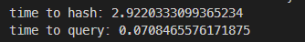

# 📑data-de-duplication

基于**simhash/minhash/tf-idf**的中文文本去重小工具，支持从excel表格导入数据，使用mysql数据库

## ✨features

* jieba分词与向量化存储，支持去除标点以及无意义助词等
* 完整的日志输出，保存检索到的重复对相关数据
* 快速执行，选用minhash算法时，对于5000篇左右的短新闻仅需3s即可完成去重

使用情况预览：



## 🔖install and usage

### install:

```bash
# clone the repository
git clone https://github.com/thethepai/data-de-duplication.git

# enter dir
cd data-de-duplication

# install requirment
pip install -r requirment.txt
```

### usage

edit `config.ini` file

run `main.py`

## ⏲️TODOs

- [ ] tfidf文档库设置，自定义词频，权重等
- [ ] 简单ui，使用界面
- [ ] dotenv或yaml配置文件支持
- [ ] 标题，内容等多种字段加权去重